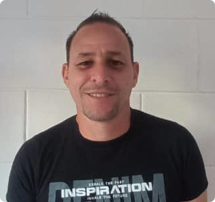

<h1 align="center">Alvaro Raul Martin Peraza - Full Stack Developer</h1>

    
    
  

  Hello, I'm Alvaro Raul Martin Peraza, a passionate Full Stack Developer with over 15 years of experience in the software development industry. I have expertise in a wide range of technologies and frameworks, enabling me to build robust and scalable solutions for diverse projects.

## Skills

I specialize in the following languages and frameworks:

- .Net
- C#
- .Net Core
- JavaScript
- React
- TypeScript
- Unity
- PHP
- Laravel
- Python
- Django
- Solidity

## Cloud Architecture

I have hands-on experience with the following Cloud Platforms:

- AWS (Amazon Web Services)
- Google Cloud Platform (GCP)
- Azure

## DevOps and Version Control

I am proficient in using the following tools:

- Docker
- Github
- GitLab

## About Me

I am passionate about software development and love to tackle complex challenges. With a strong problem-solving mindset and a deep understanding of various technologies, I strive to deliver high-quality and innovative solutions.

## Get In Touch

Feel free to connect with me for any inquiries or collaboration opportunities.

- 🌐 Website: [https://www.exagon-soft.com](https://main.d2ljmbrsen0xpy.amplifyapp.com/)
- 📧 Email: exagonsoft@gmail.com
- 🐦 Twitter: [@Exagonsoft](https://twitter.com/Exagonsoft)
- 📘 LinkedIn: [Alvaro Raul Martin Peraza](https://www.linkedin.com/in/msc-alvaro-raul-martin-peraza-165114210/)
- :octocat: GitHub [ExagonSoft](https://github.com/exagonsoft)

Let's build amazing projects together! 😊
